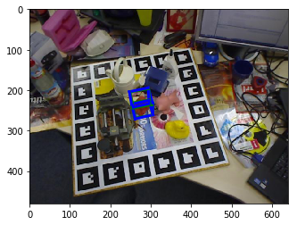
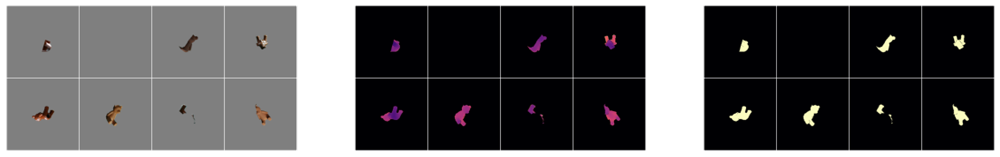

# 6D Pose Object Detector

The repository is a collection of notebooks and projects to adapts the methodlogy for 6D pose estimation to build out custom models and datasets. datasets. Quite abit of topics are covered, however, the main focus is building of BOP Benchmark Challenge for 6D Pose Estimation. 



In short __6D object pose estimation__ involves the ability to input an image RGB-D and given the depth channel construct an estimate of the full 6D pose of an object which is the 3D rotaiton and 3D trnaslation of an object. 

In addition to that, there are additional notebooks and resources outside of the main `01_BOP20_Challenge` which most likely will become a seperate repository. The other notebooks discusison a variaty of methods for 3D Objeect Reconstruciton and Rendering, estimating 2D bounding boxed and performing 2D-3D pixel coorespondences. Transitioning from 2D object detection to 6D Pose Estimation, obtaining the intuition on estimating shapes when accounting for the intrinsic camera views. 

## Introduction and Background on BOP: Benchmark for 6D Object Pose Estimation 


## Approach with Pix2Pose

For the purposes of learning the depth and breath of topics that goes into solving the 6D Pose estimation problem, we utilized the Pix2Pose method addresses the challenge of the problem by:
1.	Occlusion: estimating the 3D coordinates per-pixel and generative adversarial training
2.	Symmetry: introducing a novel L1-based transformer loss
3.	Lack of precise 3D object models: using RGB images without textured models during training phase. 

The full 6D pose is obtained by employing PnP and RANSAC over the predicted 3D coordinates. 
This is a regression based method in which we:
•	Input an RGB image
•	Input pre-processing (default = none) (contribution) augmentation to minimize overfitting
•	Training data on both real and synthetic data
•	Regression parameter using the 3D translation (x = (x, y, z))
•	Regressor Training (L1) 
•	Trained regressor (CNN)
•	Refinement step = PnP & RANSAC
•	Filtering = default none
•	Instance level


TODO: separate pix2pose and detail more on GAN generator



### Object Detection and Segmentation with Mask R-CNN

In solving the problem of 6D pose, one key requirement in order to estimate a given object's pose is to first locate the object in the image. This localization requires a corresponding 3D bounding box of the object, in which, a CNN is trained to learn the object shape. To perform the detection [Mask R-CNN from matterport](https://github.com/matterport/Mask_RCNN) is utilized taking advantage of the [Feature Pyramid Network (FPN)](https://arxiv.org/pdf/1703.06870.pdf) on a ResNet101 backbone. At the end of training, the Mask RCNN model provides 3 model outputs:
(1) segmentaiton mask 
(2) estimated predicted object class/label
(3) 2D bounding box

A known challenge that often makes pose estimation difficult is detecting and prediction object features that are under large lighting variation and occlusion. To deal with the occlusions a __Fusion__ process is performed which takes the geometry of the object model and One noteable challenge, especially w


### Network Objectives 

#### Training

Trianing the network use `python3 train.py`. The key parameters frr a basic model is to define the leaning rates *in this case we use multiple learning rates*, number of epochs and the layers used in the network. 

Adam optmizer is implimented as best practices for adjusting the learning rates by finding the variable (e.g., SGD optimizer) when training the model. 

We also seek to train with other architectures in later experiments. 

#### Infernece 

> https://github.com/florianblume/flowerpower_nn

AFter training, we can obtain 2 set of inferences:
1. object coordinate predictions
2. pose estimates

### Mask RCNN Details

* Network Weights are intialized from https://github.com/matterport/Mask_RCNN/releases

Below is a highlevel summary of the network pipeline 


TODO: detection piplelne

To summarize the network pipeline for the detector, we utilize a REsnet101 network backbone that consumes the input image with the correspondingd 2D coordinates that are used as anchors providing the localized coordinate location of a given object in an image. 

Next we intialize the ROI Branch of the network where we compute the dclosest distance between the coorponding anchors (e.g., bounding boxes) to the ground truth anchors. 

Finally, the delta branch is further refined through the training cycles based on the loss between the closes delta from the ground truth and the resulting regions proposed by the ROI branch. The objective funciton of this loss function during the training process is mimized by using a softmax output is ot minimize 


Disclaimer - I did not contribute to https://github.com/matterport/Mask_RCNN which all modificaitons I implimented are soley in this repository. 


## Notes on building Custom Dataset

- Note: in order to recover the pose of an object, the camera intrinsit matrix needs to be used. 


## Installation

Initalize the submodules: `git submodule update --init`

### Getting Started

The [Andaconda python package manager](https://www.anaconda.com/download/#linux) is utilized for managing our python libraries. Note, on first install make sure to confirm conda to the `.bashrc` for the python interpret to activate in the shell. 

The dependencies have been tested on Ubuntu 18.04 on Python 3.6+ refer to the `environment.yml` file for details. The install the dependencies run the following:

```
conda env create -f environment.yml --name sixd
conda install pytorch=0.4.1 torchvision=0.2.1 -c pytorch
conda activate sixd

```

Experiments were performed using
- Pytorch 1.X
- CUDA 10.2
- Python 3.6.7
- Ubuntu 18.04

## Dataset

#### Custom Dataset (WIP)

In order to extract the 6D pose, the following informaiton is required: 

- **camera intrinsi matrix** wich is found in the  `camera.json`
- **3D object models** which are the `.ply` and `models_info.json`
- Generate syntehtic images for training. Ive found this to be the easiest currently [BlenderProc](https://github.com/DLR-RM/BlenderProc/blob/master/README_BlenderProc4BOP.md) 

### Synthetic Data Generation 

In regards to data generation, the following are the additiona requirements: 
1. object detection in the depth image
2. pose visibility to verify no collision
3. RGBD rendering of image + random background from COCO dataset


